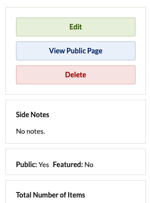
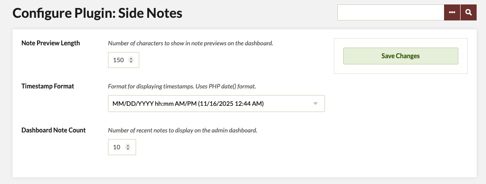

# Side Notes Plugin - Omeka Classic

SideNotes adds a dedicated internal notes layer to Omeka Classic. It allows staff to attach private notes to Items and Collections directly from the admin interface, with full tracking of who created and edited each note and when. All notes are stored in their own database table and never appear on the public site, making them ideal for curatorial workflows, cataloging coordination, provenance research, and internal communication.

The plugin integrates seamlessly with existing admin screens: notes can be edited on Item/Collection forms, viewed in the right-hand sidebar, summarized on the dashboard, and managed from a dedicated Notes browse page. Administrators can configure how many notes appear on the dashboard, how long previews should be, and how timestamps are formatted.

Key features
	•	Attach one private note to any Item or Collection (admin only, never public)
	•	Track creator, last editor, and timestamps for each note
	•	Sidebar panel and edit-form field for quick viewing and editing
	•	Dashboard panels for recent Item and Collection notes
	•	Dedicated Notes browse page with tabs, sorting, and delete actions
	•	Configurable preview length, dashboard note count, and date/time format
	•	Upgrade path that preserves existing notes from earlier versions
